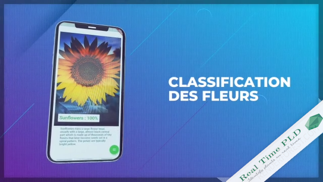
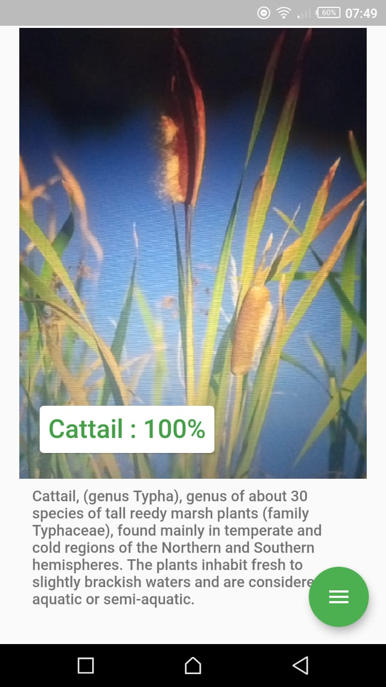
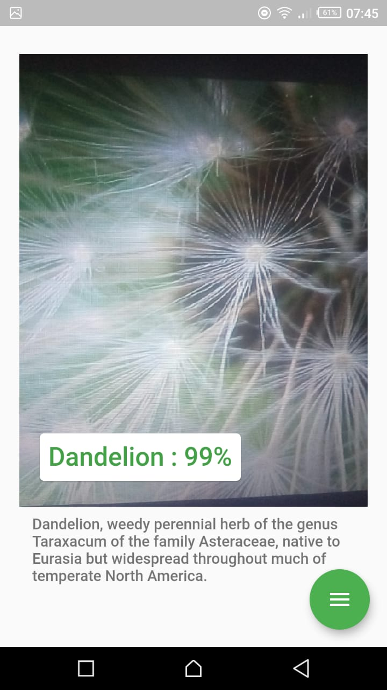

# Real time Object identification 
The real time object identification is a Flutter mobile App that identifies any object based on the dataset that the deep learning model is trained to identify. It uses the model trained on our backend to do the task.

## Screenshots
### we use the flowers dataset for the demo

